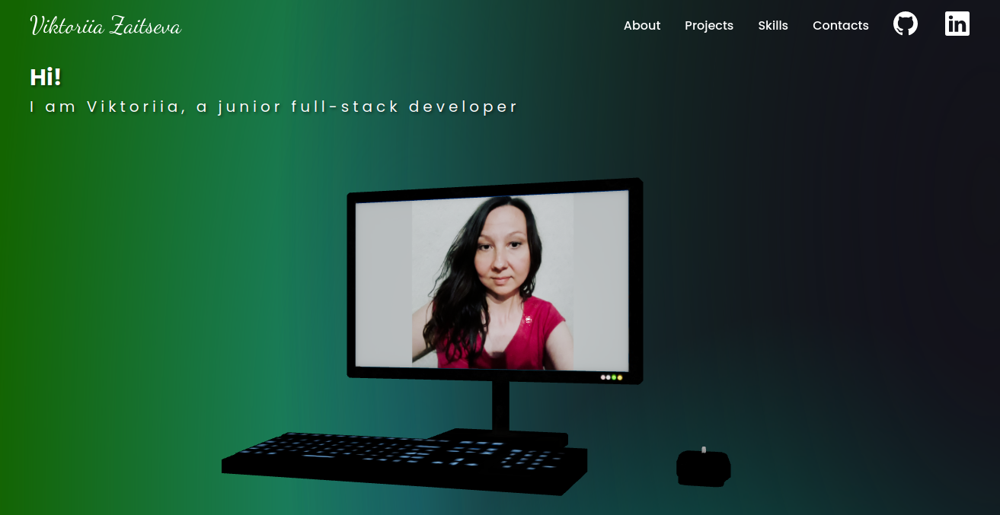
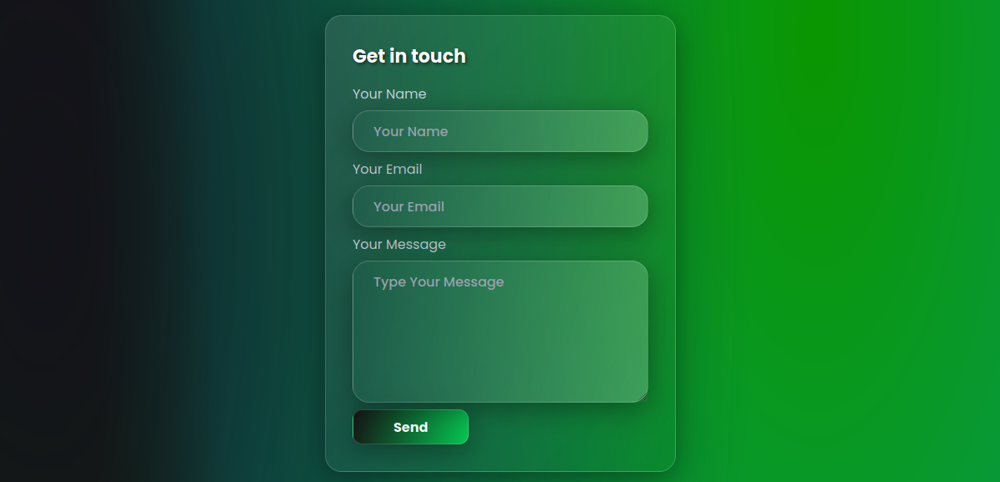
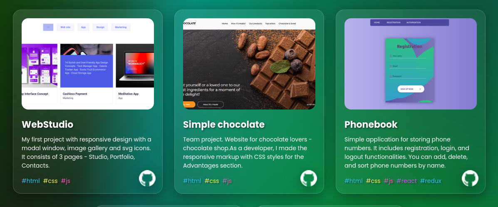

<h1 align="center">Portfolio</h1>


## Description

My portfolio are implemented using the development server Vite.js, which provides a highly efficient and fast development environment. Here you will find my projects, information about me, as well as links to profiles and a contact form.



## Tools

This application is built with React and utilizes the following libraries and packages:

- <b>three</b>: The Three.js library for 3D graphics rendering.
- <b>@react-three/fiber</b>: A React renderer for Three.js, enabling 3D graphics in a React application.
- <b>@react-three/drei</b>: Enhances the functionality of React Three Fiber, facilitating 3D rendering.
- <b>react-icons</b>: Offers a vast collection of icons for use in the project.
- <b>formik</b>: A library for building and validating forms in React.
- <b>yup</b>: For schema validation, ensuring data integrity in forms and inputs.
- <b>@emailjs/browser</b>: For email functionality.
- <b>notistack</b>: Provides a notification system for the application.
- <b>framer-motion</b>: Used for animations and transitions.
- <b>react-tilt</b>: Adds interactive parallax tilt effect to elements.



### CSS

- This was my first time using Tailwind CSS for styling, a highly efficient utility-first CSS framework. Tailwind CSS streamlines the development process by providing a wide range of pre-designed utility classes that can be easily applied to HTML elements. This approach promotes rapid development, improved maintainability, and consistent styling throughout the project.

## Project setup

```
npm install
npm run dev

```
